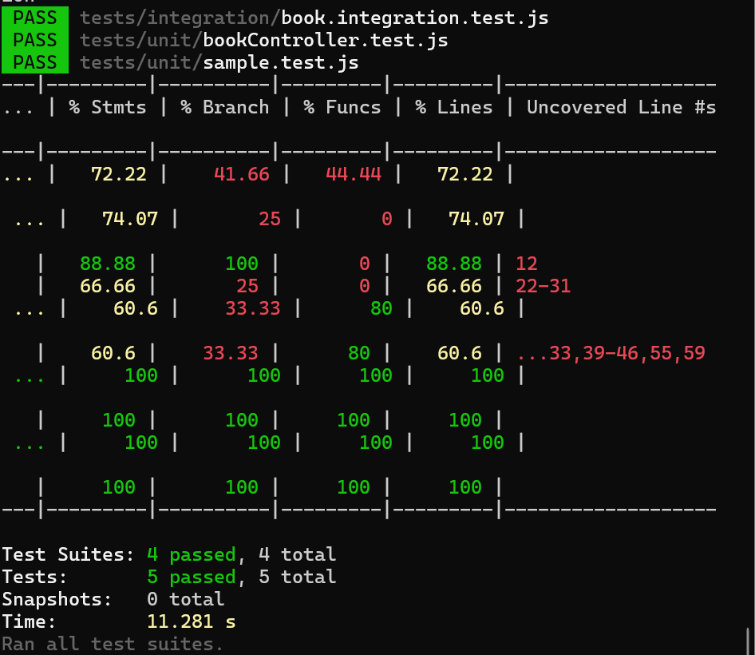

# Book API Server

This is a custom REST API built using **Node.js**, **Express**, and **MongoDB**.  
It allows users to perform CRUD operations on a list of books.

---

## 🔧 Technologies Used

- Node.js
- Express.js
- MongoDB (with Mongoose)
- dotenv (for environment variables)
- CORS
- Postman / curl (for testing)

---

## 🚀 How to Run the Server

### 1. Clone the Repository

## Keploy Test Report

Below is a sample Keploy test report generated after running API tests through the Keploy sidecar proxy. This demonstrates automated API test generation and execution for the Book API server.

- The screenshot above shows the Keploy test report UI after running tests.
- To update this screenshot, run your API tests through Keploy, then take a new screenshot and replace `assets/coverage.png`.

---

For more details, see the [Keploy documentation](https://docs.keploy.io/).
